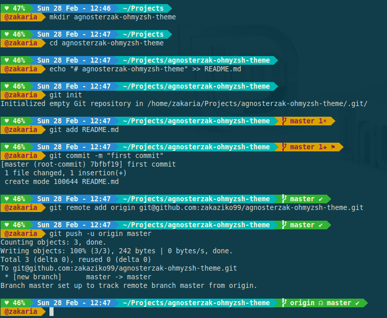
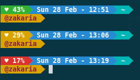
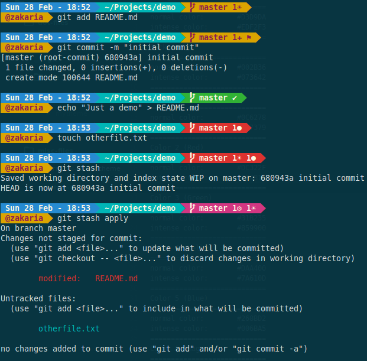
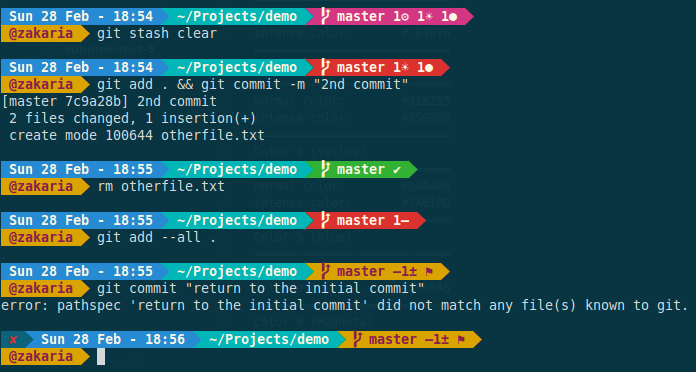

# AgnosterZak for oh-my-zsh 

AgnosterZak is a [oh-my-zsh shell](https://github.com/robbyrussell/oh-my-zsh) theme based on the
[Powerline Vim plugin](https://github.com/Lokaltog/vim-powerline) &
[Agnoster Theme](https://gist.github.com/agnoster/3712874).

It currently shows:
- Battery Life (in case of the laptop is not charging)
- Timestamp
- Current directory
- Git status
- User & Host status

## Preview




## Other color schemes

It's better to use AgnosterZak with a Solarized dark color scheme or others dark color schemes.


## Requirements

In order to use the theme, you will first need:

* Powerline compatible fonts like [Vim Powerline patched fonts](https://github.com/Lokaltog/powerline-fonts), [Input Mono](http://input.fontbureau.com/) or [Monoid](http://larsenwork.com/monoid/).
* On Ubuntu like systems you'll need the `ttf-ancient-fonts` package to correctly display some unicode symbols that are not covered by the Powerline fonts above.
* A ZSH framework like [oh-my-zsh](https://github.com/robbyrussell/oh-my-zsh)


## Installing

After installing [oh-my-zsh](https://github.com/robbyrussell/oh-my-zsh)

1. Download the theme [here](http://raw.github.com/zakaziko99/agnosterzak-ohmyzsh-theme/master/agnosterzak.zsh-theme)

2. Put the file **agnosterzak.zsh-theme** in **$ZSH_CUSTOM/themes/**

3. Configure the theme in your **~/.zshrc** file:

```bash
ZSH_THEME="agnosterzak"
```

## Options

AgnosterZak is configurable. You can change colors and which segments you want
or don't want to see. All options must be overridden in your **.zshrc** file.

## Segments

### Battery Life

The info will display in case of the laptop is not charging



|Battery status|Color
|--------------|-----|
|more than 39%|`green`
|less than 40% and more than 19%|`yellow`
|less than 20%|`red`

### Git




#### Color States
|Background Color & Foreground Color|Meaning
|----------------|----------------|
||Absolutely clean state
||There are stashed files
||There are new untracked files
||There are modified or deleted files but unstaged

#### Icons
|Icon|Meaning
|----|-------|
|`✔`|clean directory
|`☀`|new untracked files preceeded by their number
|`✚`|added files from the new untracked ones preceeded by their number
|`‒`|deleted files preceeded by their number
|`●`|modified files preceeded by their number
|`±`|added files from the modifies or delete ones preceeded by their number
|`⚑`|ready to commit
|`⚙`|sets of stashed files preceeded by their number
|`☊`|branch has a stream, preceeded by his remote name
|`↑`|commits ahead on the current branch comparing to remote, preceeded by their number
|`↓`|commits behind on the current branch comparing to remote, preceeded by their number
|`<B>`|bisect state on the current branch
|`>M<`|Merge state on the current branch
|`>R>`|Rebase state on the current branch

## Credits

This theme is highly inspired by the following themes:
- [Powerline](https://github.com/jeremyFreeAgent/oh-my-zsh-powerline-theme)
- [Agnoster](https://gist.github.com/agnoster/3712874)
